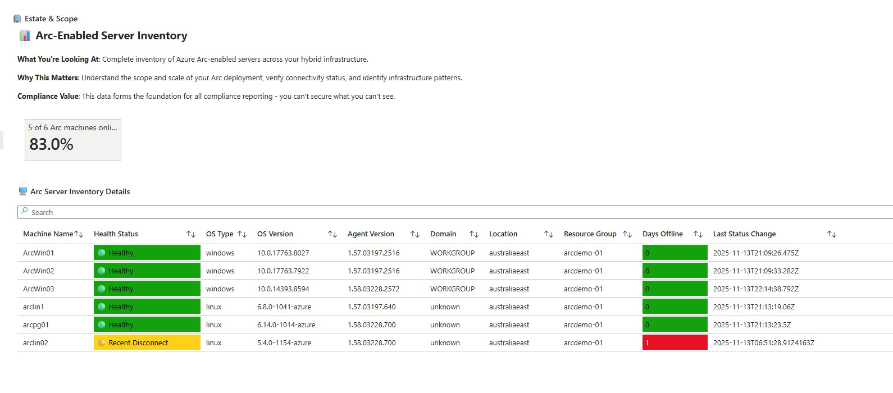
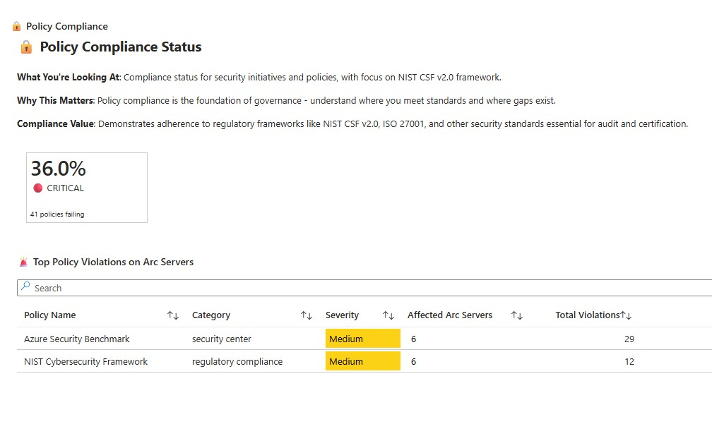
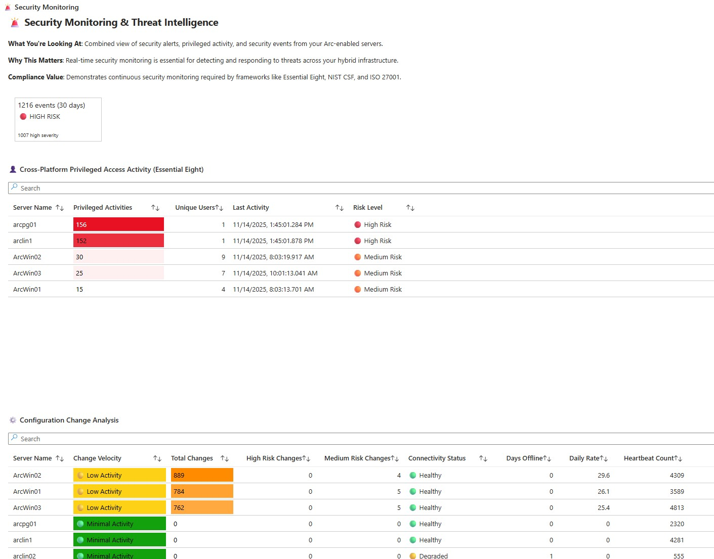
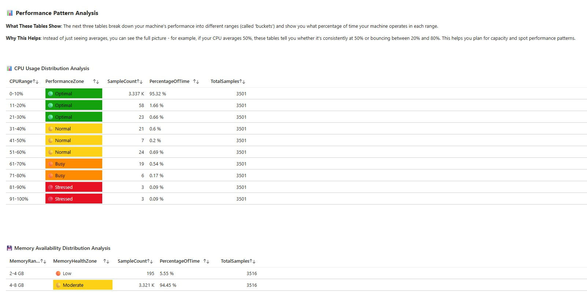
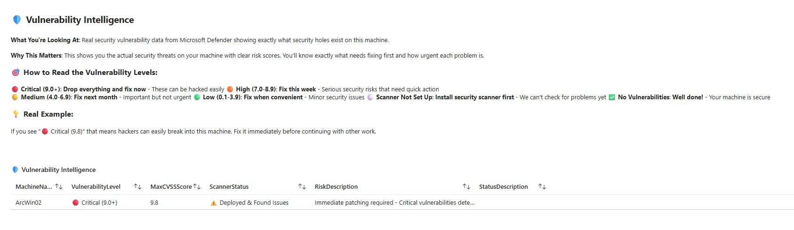
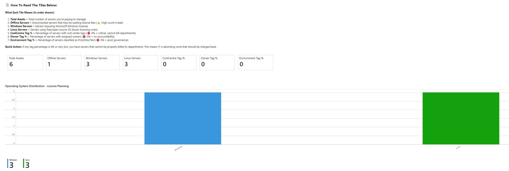
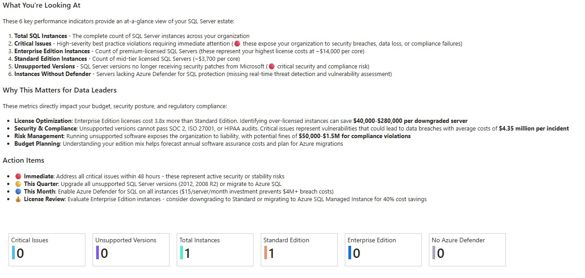
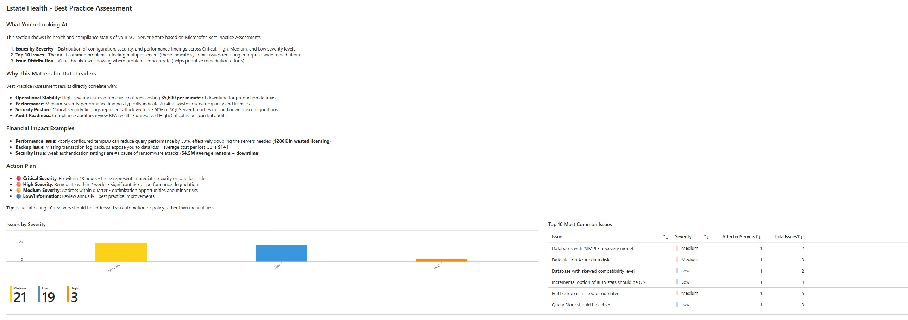

# Azure Arc Workbooks Collection


## Overview

Using **Azure Arc**, organisations can gather all sorts of interesting data points from their hybrid and multi-cloud infrastructure. **Azure Monitor Workbooks** help bring that data together in interesting and useful ways, providing actionable insights across your entire estate.

Workbooks are really useful and easy to get started with. Using **GitHub Copilot Agent mode**, I was able to author and iterate quickly over these samples, quickly, 3 days.  I would not have been able to do this especially getting help with the complex queriers.

My hope is that these workbooks encourage you to discover what Azure Arc can make possible. Whether you’re experimenting, learning, or building solutions, may they help you drive impact across your teams and organizations.

> [!IMPORTANT]
> The text in these workbooks is not official guidance from Microsoft, Azure, or any other third party. It should be updated to reflect the guidance of your organisation or your customer. This ensures that readers understand your organisation's own view, position, and recommended actions.

---

## 🎯 What's Inside

This collection includes several Azure Monitor Workbooks samples designed to help you visualise and analyse your Azure Arc-enabled infrastructure:

### 🛡️ Compliance, Security & Governance
**Enterprise-grade compliance reporting across your hybrid estate**

Demonstrates how Azure Arc enables unified compliance management:
- 📊 **Estate & Scope** - Complete inventory with connectivity health
- 🔒 **Policy Compliance** - NIST CSF v2.0 compliance tracking
- 🔧 **Patch Posture** - Update Manager security status
- 👤 **Privileged Activity** - Essential Eight admin monitoring
- 🔐 **Protocol Hardening** - TLS and secure communication compliance
- 🚨 **Security Alerts** - Defender for Cloud threat analysis
- ⚙️ **Configuration Drift** - Change tracking and governance






---

### 🤖 Arc Machine Intelligence Center
**A 360-degree view of any Azure Arc machine**

Get comprehensive insights into individual machines with:
- 🔍 **Live Performance Data** - CPU, memory, disk, and network metrics
- 🛡️ **Security Health** - Microsoft Defender alerts and threat intelligence
- 🔒 **Vulnerability Intelligence** - Real CVSS risk scores and detailed security assessments
- 💾 **Software Tracking** - Installation history and change management
- 🗄️ **SQL Server Details** - Database inventory and performance (when applicable)
- ⚙️ **Arc Management** - Extensions, policies, and compliance status
- 📊 **Operations Timeline** - Connection history and maintenance events





---

### 🏥 Asset Inventory & License Management
**Executive procurement intelligence for IT asset optimization**

Designed for procurement executives and IT finance leaders:
- 📦 **Asset Inventory** - Real-time visibility into Arc-enabled servers
- 💰 **Licence Optimisation** - SQL Server edition analysis for cost reduction
- 💼 **Financial Governance** - Tag compliance for accurate cost allocation
- 🤝 **Vendor Management** - Software consolidation opportunities
- ✅ **Compliance** - Audit-ready reporting for licence management



---

### 🗄️ SQL Estate Dashboard
**Strategic oversight of your SQL Server environment**

This workbook provides data executives with:
- 📊 **Licence Optimisation** - Edition analysis and cost-saving opportunities
- ⚖️ **Compliance Risk Management** - Regulatory and audit tracking
- 💵 **Cost Control** - Financial planning and chargeback insights
- 🚀 **Performance Health** - Database performance monitoring
- 📈 **Capacity Planning** - Resource utilization and growth trends




---

### 🔬 Governance & Compliance Experiment
**Advanced compliance framework demonstration**

This was an experimental workbook I started with to explore advanced compliance scenarios and custom governance patterns. I've included it in this repo to share some ideas. 

---

## 🚀 Getting Started

### Prerequisites
- Azure subscription with Azure Arc-enabled servers
- Azure Monitor workspace
- Appropriate RBAC permissions (Reader or higher on Arc resources)
- Some of the data is collected using other Azure services. For example, Azure Arc Inventory and Change Log are required to get inventory information.

### Deployment

1. **Clone or download this repository**
   ```bash
   git clone <your-repo-url>
   ```

2. **Import a workbook into Azure Portal**
   - Navigate to Azure Monitor in the Azure Portal
   - Go to **Workbooks** → **+ New**
   - Click the **</>** (Advanced Editor) button
   - Select the **Gallery Template** tab
   - Copy the contents of any workbook JSON file from the `workbooks/` folder
   - Paste into the editor
   - Click **Apply**
   - Click **Done Editing**
   - **Save** the workbook to your preferred location

3. **Configure the workbook**
   - Select your subscription(s)
   - Choose time ranges
   - Select specific Arc machines or resources as needed

---

## 📊 Workbook Files

| Workbook | File | Description |
|----------|------|-------------|
| Arc Machine Intelligence Center | `ArcMachineIntelligenceCenter.json` | Single-machine deep dive dashboard |
| Compliance & Security | `Arc_Compliance_Security_Governance_example.json` | Enterprise compliance reporting |
| Asset Inventory | `Asset_Inventory_Workbook_Example.json` | Licence and asset management |
| SQL Estate Dashboard | `SQL_Estate_Dashboard.json` | SQL Server executive intelligence |
| Governance Experiment | `GovernanceComplianceWorkbook_Experiment.json` | Advanced compliance patterns |

---

## 💡 Key Benefits

### 📈 **Unified Visibility**
Bring together data from Azure Resource Graph, Azure Monitor Logs, Microsoft Defender, and Update Manager into cohesive dashboards.

### ⚡ **Fast Development**
Using GitHub Copilot, these workbooks were developed rapidly through iterative refinement, demonstrating how AI-assisted development accelerates solution delivery.

### 🎯 **Actionable Insights**
Each workbook is designed to answer specific business questions and drive action - from security remediation to cost optimization.

### 🔄 **Easily Customizable**
All workbooks are built using KQL (Kusto Query Language) and can be easily modified to fit your organisation's specific needs.

---

## 🛠️ Customization Tips

- **Modify Queries**: Edit the KQL queries to focus on specific resource groups, tags, or custom properties
- **Add Parameters**: Add more filters for better control
- **Extend Visualisations**: Add charts, grids, and metrics that matter to your organisation
- **Theme Adjustments**: Customize colors and icons to match your corporate branding

---

## 🤝 Contributing

This is a sample collection to demonstrate the art of the possible. Feel free to:
- Fork and adapt for your needs
- Submit suggestions or improvements
- Share your own workbook variations

---

## 📝 Notes

- **Data Sources**: These workbooks query Azure Resource Graph, Log Analytics workspaces, and other Azure Monitor data sources
- **Permissions**: Ensure users have appropriate read permissions on the resources they want to monitor
- **Cost**: Workbooks themselves are free; standard charges apply for Log Analytics data ingestion and retention

---

## 📚 Resources

- [Azure Arc Documentation](https://docs.microsoft.com/azure/azure-arc/)
- [Azure Monitor Workbooks](https://docs.microsoft.com/azure/azure-monitor/visualize/workbooks-overview)
- [KQL Reference](https://docs.microsoft.com/azure/data-explorer/kusto/query/)
- [GitHub Copilot](https://github.com/features/copilot)

---

## 📸 Gallery

<details>
<summary>Click to view all screenshots</summary>

### Machine Intelligence Center


### Compliance & Security


### Asset Inventory


### SQL Estate Dashboard


### Governance Experiment


</details>

---

**Built with ❤️ using GitHub Copilot and Azure Arc**
